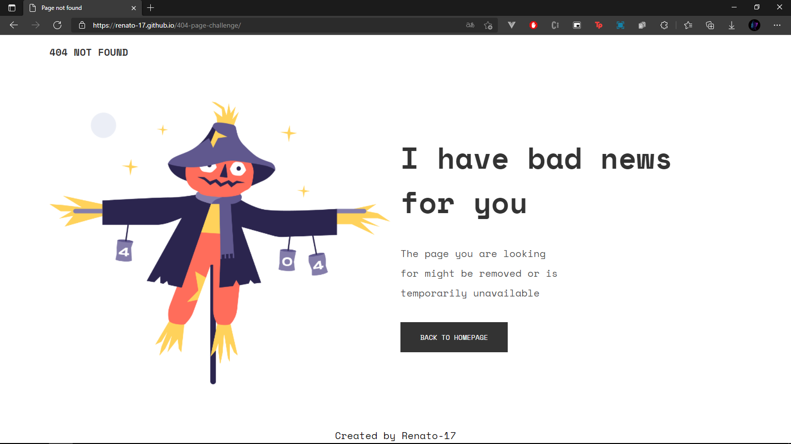

<!-- Please update value in the {}  -->

<h1 align="center">404 not found page</h1>

   Solution for a challenge from  <a href="http://devchallenges.io" target="_blank">Devchallenges.io</a>.

  <h3>
    <a href="https://renato-17.github.io/404-page-challenge/" target="_blank">
      Demo
    </a>
     | 
    <a href="https://renato-17.github.io/404-page-challenge/" target="_blank">
      Solution
    </a>
     | 
    <a href="https://devchallenges.io/challenges/wBunSb7FPrIepJZAg0sY" target="_blank">
      Challenge
    </a>
  </h3>

<!-- OVERVIEW -->

## Overview

